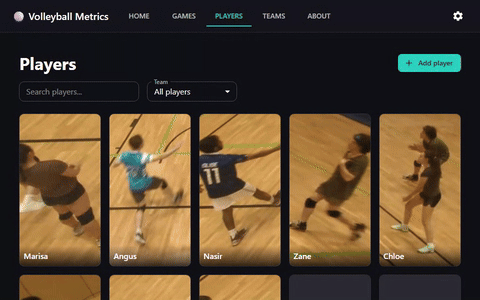
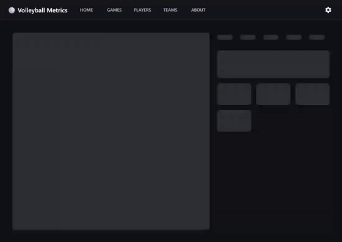

<div align="center">

# 🏐 Volleyball Metrics

**Turn a raw volleyball match recording into player stats, team analytics, and an annotated video — automatic court calibration, player/ball tracking, rally segmentation, and action detection under the hood.**

</div>

Upload a video, click the four court corners once, and the pipeline takes it from there: it tracks every player and the ball, segments the match into rallies, classifies each touch (serve/set/spike/dig/block), and rolls all of that up into a per-player and per-team stats dashboard plus an annotated copy of the video.

<!--
  Demo GIFs go here. Drop capture files into docs/assets/ using the names
  below and these will render — nothing else in the README needs to change.
-->

<details>
<summary>🎬 <strong>Demo</strong></summary>

| Upload & tracking | Rally & action detection | Stats dashboard |
| :---: | :---: | :---: |
|  |  |  |

</details>

## 📖 About

I got fed up with volleyball analytics platforms that charge clubs and individual players absurd subscription fees for something a laptop and a few open-source models can already do. Coaches and players who just want to know their hitting efficiency or where their serve receive breaks down shouldn't have to pay per-video or per-seat for it. So I built this: a self-hosted pipeline that takes a normal match recording — a phone on a tripod, a wall-mounted camera, whatever — and turns it into the same kind of stats the paid tools sell, for free, running on your own machine. 🎉

This project was developed with heavy use of AI-assisted coding (Claude Code) — from the tracking/re-identification logic to the FastAPI backend and the React frontend. It's a solo project and that's what made a pipeline this size tractable to build and iterate on. 🤖

<details>
<summary>💡 <strong>Inspiration</strong></summary>

This project builds directly on ideas and open datasets from:

- **[shukkkur/VolleyVision](https://github.com/shukkkur/VolleyVision)** — the original inspiration for tackling volleyball with a staged detection/tracking pipeline (ball → players/actions → court), and the source of several of the ball and action detection datasets below.
- **[masouduut94/volleyball_analytics](https://github.com/masouduut94/volleyball_analytics)** — inspiration for treating rally/game-status segmentation as its own video-classification stage, and the source of the fine-tuned VideoMAE checkpoint this project's rally detector is built on.

</details>

## 🙋 Why I'm building this

- 🎯 Give teams and individual players a free, accurate way to see how they're actually performing, not just a highlight reel.
- 📊 Turn raw footage into the kind of per-player and per-team analytics that used to require a paid platform or a manual stat-taker.
- 🧠 Keep improving detection accuracy over time by growing the labeled dataset behind each classifier (ball, action, court, game status) rather than shipping a model once and leaving it.
- 🤝 Do it in the open, on top of the open datasets and prior work that made it possible, and credit that work properly.
- 💸 Prove that this doesn't need to cost a subscription — a decent GPU and an evening of setup should be enough.

## ⚙️ What it does

- 📐 **Court calibration** — click the four court corners and net points once; everything downstream (player positions, ball speed, court-relative stats) is computed in real court coordinates, not raw pixels.
- 🏃 **Player detection & tracking** — a YOLO detector plus a custom multi-tracker ensemble with appearance-based re-identification, so a player keeps their identity even after being briefly occluded or leaving the frame.
- 🏐 **Ball detection & speed** — a volleyball-specific fine-tuned detector tracks the ball and estimates its real-world speed.
- 🔁 **Game status / rally detection** — a fine-tuned video classifier segments the match into rallies vs. dead-ball stretches.
- 🥅 **Action detection** — classifies each touch by type (serve, set, spike, dig, block) and attributes it to a player.
- 🧑‍🤝‍🧑 **Player review** — name detected players from a reusable roster, merge duplicate detections, or ignore false positives (refs, coaches) — with a hint when two separate detections might be the same person.
- 🏆 **Scoring** — track which side won each rally and how rallies group into games, either by hand, automatically (inferred from ball/player position), or by reading a scoreboard on screen (OCR) — all correctable afterward.
- 👕 **Teams** — group roster players into named teams (e.g. "Varsity") independent of any one video; a team's page rolls up its win/loss record, a win-rate-by-action radar, and hit-count stats across every video it's played in.
- 📈 **Results page** — per video: an Overview tab (hit counts plus a weighted quality score for serve/receive/set/spike, factoring in speed, placement, and trajectory height), a Stats tab (win/loss record and win-rate radar), a Rallies tab (grouped by game, with the winner highlighted), an Actions tab (every detected touch, filterable), and a Setup tab (court calibration, player review, scoring).
- 🎥 **Annotated video & dashboard** — a rendered copy of the video with tracking overlays, plus a standalone HTML stats dashboard.

## 🖥️ Frontend

The frontend is a React + TypeScript SPA. The main areas:

<details>
<summary>📸 <strong>Screenshots &amp; demos</strong></summary>

| Videos & upload | Teams | Players |
| :---: | :---: | :---: |
|  |  |  |

Per-video setup (the **Setup** tab):

| Scoring | Court calibration | Player identification |
| :---: | :---: | :---: |
|  |  |  |

</details>

- 📹 **Videos** — upload a match, watch pipeline stage progress live, and jump into any past video's results.
- 👥 **Teams / Players** — roster management, team win/loss and win-rate-by-action radars, per-player stats across every video they've appeared in.
- 🏅 **Scoring** — set scoring mode (manual / automatic / scoreboard OCR), pick the score-region on screen for OCR, and correct any rally-to-game grouping afterward.
- 📐 **Court calibration** — click the four court corners and (optionally) the net-top points once per video; used for every downstream court-relative and height-based calculation.
- 🕵️ **Player identification** — review detected players, name them from the roster, merge duplicates, or ignore false positives (refs, coaches, spectators).

## 🛠️ Backend

FastAPI app orchestrating a multi-stage pipeline; each stage is a self-contained module under `Backend/Analysis/`.

```
Backend/
  API/                    FastAPI app: auth, job orchestration, stage pipeline, routers per resource
  Analysis/
    PlayerDetection/      YOLO detection + custom multi-tracker ensemble with ReID (tracker.py)
    CourtDefinition/      Court corner/net keypoint model + homography (court.py)
    BallDetection/        Volleyball-specific fine-tuned detector + trajectory smoothing
    GameStatusDetection/  Rally segmentation (fine-tuned VideoMAE classifier)
    ActionDetection/      Per-touch action classification (serve/set/spike/dig/block)
    PostProcessing/       Stats consolidation, dashboard generation, annotated video rendering
    MachineLearning/      Dataset gathering/merging + training entry points for every model above
```

<details>
<summary>🔬 <strong>Stage-by-stage details</strong></summary>

- **API** (`Backend/API/`) — auth, video upload, job/stage orchestration (`stage_runner.py`, `pipeline.py`), roster/team/player CRUD, scoring (manual/automatic/OCR via `score_cv.py`), sharing, and a router per resource under `routers/`.
- **Player detection & tracking** (`PlayerDetection/tracker.py`) — Ultralytics YOLO for detection, fed into a custom 5-tracker ensemble with a ResNet18-based appearance encoder for re-identifying players who briefly leave the frame or get occluded. Heuristics on top: track-merge scoring by IoU + appearance-embedding distance + motion continuity, and confidence gating to suppress crowd/spectator false positives.
- **Court definition** (`CourtDefinition/court.py`) — a keypoint model locates the court corners/net points; a heuristic homography solve maps pixel space to real court coordinates, and a single-view camera pose (from the two net-top points) drives height estimation for the ball and jumps.
- **Ball detection** (`BallDetection/ballDetection.py`) — a fine-tuned detector plus a trajectory smoother/interpolator (heuristic Kalman-style gap filling) to bridge frames where the ball is occluded or motion-blurred, and a real-world speed estimate from the court homography.
- **Game status detection** (`GameStatusDetection/gameStatusDetection.py`) — a fine-tuned VideoMAE video classifier labels each window as play / no-play / serve, which is stitched (with heuristic minimum-duration and boundary-snapping rules) into rally start/end boundaries.
- **Action detection** (`ActionDetection/actionDetection.py`) — a classifier attributes each touch to a type and, combined with player-track proximity heuristics, to a specific player.
- **Post-processing** (`PostProcessing/`) — consolidates all per-frame detections into rally/game/player stats (`consolidate.py`), renders the annotated video (`renderVideo.py`), transcodes for playback (`transcode.py`), and generates a standalone HTML dashboard (`generate_dashboard.py`).

</details>

## 📚 Datasets & credits

Every fine-tuned model below is a **YOLOv8-format** dataset merged from one or more open [Roboflow Universe](https://universe.roboflow.com) datasets via `Backend/Analysis/MachineLearning/datasetGather.py`, then trained by `mainTrainingModels.py`. Full attribution is also shown in-app under **About**.

**Ball detection** — YOLO11m, fine-tuned on ~2,260 images merged from 4 sources (all CC BY 4.0):

- [aivolleyballref/volleyball_detection](https://universe.roboflow.com/aivolleyballref/volleyball_detection) — 771 images
- [primaryws/volleyball_ball_object_detection_dataset](https://universe.roboflow.com/primaryws/volleyball_ball_object_detection_dataset) — 548 images
- [salo-levy-nlqrn/volley-ball-detection](https://universe.roboflow.com/salo-levy-nlqrn/volley-ball-detection) — 120 images
- [volleyballtest/volleyball-fdqxb](https://universe.roboflow.com/volleyballtest/volleyball-fdqxb) — 820 images
- 🎥 **Your own footage** — optionally supplemented automatically: `BallDatasets.pseudo_label_own_footage()` turns this project's own high-confidence ball detections from already-processed jobs into new training labels, so accuracy compounds as you use the app.

**Action detection** — trained from scratch for this project, on ~29,000 images merged from 4 sources (all CC BY 4.0):

- [shukur-sabzaliev-zc3en/volleyball-activity-dataset](https://universe.roboflow.com/shukur-sabzaliev-zc3en/volleyball-activity-dataset) — 25,000 images, uploaded by [Shakhansho Sabzaliev](https://github.com/shukkkur) (VolleyVision), sourced from Graz University of Technology's [Volleyball Activity Dataset](https://www.tugraz.at/index.php?id=17751) (Austrian Volley League 2011/12)
- [vbanalyzer/volleyball-action-recognition-k6tqv](https://universe.roboflow.com/vbanalyzer/volleyball-action-recognition-k6tqv) — 1,806 images
- [vballactionrecognition/volleyball-action-recognition-7rnpb](https://universe.roboflow.com/vballactionrecognition/volleyball-action-recognition-7rnpb) — 1,003 images
- [mikhail-klyukin/volleyball_dataset](https://universe.roboflow.com/mikhail-klyukin/volleyball_dataset) — 1,236 images
- 🎥 **Your own footage** — not yet automated (see [Roadmap](#-roadmap)); for now this class grows only through the open sources above.

**Court keypoints** — 862 images (CC BY 4.0):

- [primaryws/volleyball_court_keypoints_regression_dataset](https://universe.roboflow.com/primaryws/volleyball_court_keypoints_regression_dataset)
- 🎥 **Your own footage** — optionally supplemented automatically: `CourtDatasets.extract_own_footage_keypoints()` turns this project's own already-confirmed court calibrations into new labeled keypoint frames.

**Game status / rally detection** — a [masouduut94/volleyball_analytics](https://github.com/masouduut94/volleyball_analytics) fine-tuned VideoMAE checkpoint, base model `MCG-NJU/videomae-base-finetuned-kinetics` (Hugging Face, CC-BY-NC-4.0 — non-commercial use only).
- 🎥 **Your own footage** — not yet automated (see [Roadmap](#-roadmap)); this stage currently relies solely on the fine-tuned checkpoint above.

**Player detection** — [Ultralytics YOLO](https://github.com/ultralytics/ultralytics) (AGPL-3.0 / commercial license); re-identification is a ResNet18 appearance encoder trained for this project.

## 🗺️ Roadmap

The single biggest lever on accuracy right now is dataset size, not architecture — every classifier above is trained on a few hundred to a few thousand labeled examples per class. Priorities, roughly in order:

- [ ] Grow the labeled action-detection set, especially underrepresented classes (block, dig) and lower-level/casual play (most existing data skews toward high-level matches).
- [ ] Expand ball-detection training data with more occlusion, motion-blur, and indoor-lighting variety.
- [ ] Add more court/net keypoint examples across camera angles and gym setups.
- [ ] Reduce false-positive player detections from spectators/coaches near the court.
- [ ] Package the model checkpoints as a downloadable release instead of a manual setup step.

## 🧰 Tech stack

- **Backend**: Python, FastAPI, PyTorch, Ultralytics YOLO, Hugging Face Transformers (VideoMAE), OpenCV
- **Frontend**: React, TypeScript, Vite, MUI (Material UI), React Router

## 🚀 Getting started

### ✅ Prerequisites

- Python 3.11+ with a virtual environment at `Backend/.venv`
- Node.js 18+
- A CUDA-capable GPU is strongly recommended (tracking and the game-status classifier both run PyTorch models per frame/window)

### 🐍 Backend setup

```bash
cd Backend
python -m venv .venv
.venv\Scripts\activate      # Windows
pip install -r requirements.txt
```

The game-status classifier expects a fine-tuned VideoMAE checkpoint at `Backend/Analysis/GameStatusDetection/Models/VolleyballAnalytics/3-states/checkpoint/` (see [Datasets & credits](#-datasets--credits) above — it's not bundled in this repo).

### 📦 Frontend setup

```bash
cd Frontend
npm install
```

### ▶️ Running

From the repo root:

```bash
start.bat
```

This launches the backend (`uvicorn API.main:app --reload --host 0.0.0.0 --port 8000`) and the frontend dev server (`npm run dev`, Vite — defaults to `http://localhost:5173`) each in their own window. Open the frontend URL and upload a video to get started. 🏐

Both bind to `0.0.0.0` rather than just `localhost`, so another device on the same network (a phone, a laptop) can reach them via this machine's own IP — e.g. `http://192.168.1.27:5173`. If you launch the backend by hand instead of via `start.bat`, include `--host 0.0.0.0` yourself, or it'll silently fall back to loopback-only and be unreachable from anywhere but this machine.

## 📄 License

<details>
<summary>Show license details</summary>

**Code** — original code in this repository is not currently under a published open-source license. All rights are reserved by default unless/until a license file is added; please ask before reusing or redistributing it.

**Third-party licenses**, by component:

| Component | License |
| --- | --- |
| Ball, action, and court datasets (Roboflow Universe sources) | CC BY 4.0 |
| Game-status base model (`MCG-NJU/videomae-base-finetuned-kinetics`) | CC-BY-NC-4.0 (non-commercial only) |
| Player detection (Ultralytics YOLO) | AGPL-3.0, or a commercial Ultralytics license |

See [Datasets & credits](#-datasets--credits) above for the full per-dataset attribution.

</details>
