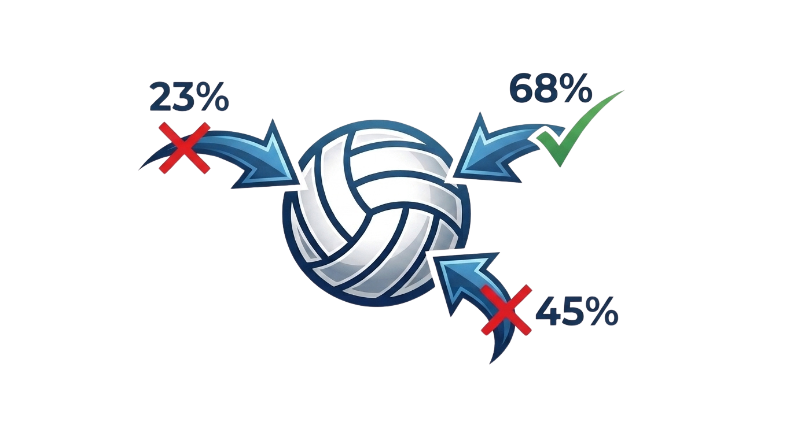
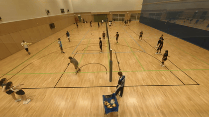
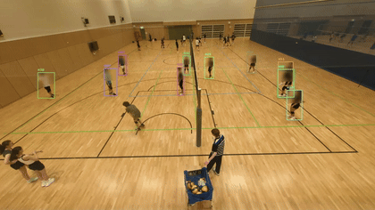
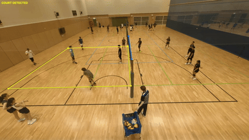
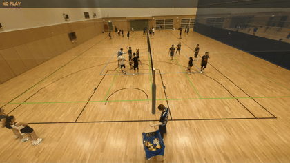
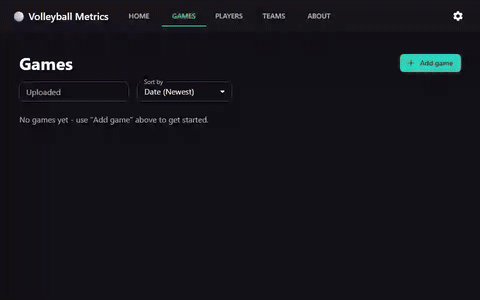

<div align="center">



# Volleyball Metrics

</div>

### Demo

| Ball detection | Player detection |
| :---: | :---: |
|  |  |

| Court detection | Game status detection |
| :---: | :---: |
|  |  |

## About

Justed wanted free AI video analysis for volleyball with a user friendly interface. I used paid solutions but locked down higher tiers of analysis behind paywall. Reviewed existing opensource projects but thought they lack accuracy and easy of use of the commercial products.

**NOTE:** This project had the use of generative AI.

## Objectives

- Easy of Use
- Provide useful insights on game/team and individual bases
- Leverage Both Heurestics and Trainned models to increase accuracy
- Limit the amount of input needed from a user.
- Optimise general pipeline to make processing efficient enough to run a low tier server (Make easy to host)

## Inspiration

I was inspired by various high rated open source projects that had decent volleyball pipelines and general analysis.

- **[shukkkur/VolleyVision](https://github.com/shukkkur/VolleyVision)** — the original inspiration for tackling volleyball with a staged detection/tracking pipeline (ball → players/actions → court), and the source of several of the ball and action detection datasets below.
- **[masouduut94/volleyball_analytics](https://github.com/masouduut94/volleyball_analytics)** — inspiration for treating rally/game-status segmentation as its own video-classification stage, and the source of the fine-tuned VideoMAE checkpoint this project's rally detector is built on.

## Architecture

- **Backend**: Python, FastAPI, PyTorch, Ultralytics YOLO, Hugging Face Transformers (VideoMAE), OpenCV
- **Frontend**: React, TypeScript, Vite, MUI (Material UI), React Router

## Frontend

### Screenshots & demos

| Games | Teams | Players |
| :---: | :---: | :---: |
|  |  |  |

Per-video setup (the **Setup** tab):

| Scoring | Court calibration | Player identification |
| :---: | :---: | :---: |
|  |  |  |

<details>

## Backend

FastAPI app orchestrating a multi-stage pipeline; each stage is a self-contained module under `Backend/Analysis/`.

```
Backend/
  API/                    FastAPI app: auth, job orchestration, stage pipeline, routers per resource
  Analysis/
    PlayerDetection/      YOLO detection + custom multi-tracker ensemble with ReID (tracker.py)
    CourtDefinition/      Court corner/net keypoint model + homography (court.py)
    BallDetection/        Volleyball-specific fine-tuned detector + trajectory smoothing
    GameStatusDetection/  Rally segmentation (fine-tuned VideoMAE classifier)
    ActionDetection/      Per-touch action classification (serve/set/spike/dig/block)
    PostProcessing/       Stats consolidation, dashboard generation, annotated video rendering
    MachineLearning/      Dataset gathering/merging + training entry points for every model above
```


## Detection & Analysis

Every fine-tuned model below is a **YOLO-format** dataset merged from one or more open [Roboflow Universe](https://universe.roboflow.com) datasets via `Backend/Analysis/MachineLearning/datasetGather.py`, then trained by `mainTrainingModels.py`. Full attribution is also shown in-app under **About**.

<details>
<summary><strong>Ball detection</strong></summary>

**Datasets used** — YOLO11m/YOLO26x, fine-tuned on ~2,260 images merged from 4 sources (all CC BY 4.0):

- [aivolleyballref/volleyball_detection](https://universe.roboflow.com/aivolleyballref/volleyball_detection) — 771 images
- [primaryws/volleyball_ball_object_detection_dataset](https://universe.roboflow.com/primaryws/volleyball_ball_object_detection_dataset) — 548 images
- [salo-levy-nlqrn/volley-ball-detection](https://universe.roboflow.com/salo-levy-nlqrn/volley-ball-detection) — 120 images
- [volleyballtest/volleyball-fdqxb](https://universe.roboflow.com/volleyballtest/volleyball-fdqxb) — 820 images
- **My own footage** — supplemented automatically: `BallDatasets.pseudo_label_own_footage()` turns my own already-processed matches' high-confidence ball detections into new training labels, so accuracy keeps improving the more I use the app.

**How it works**

- A 2-model ensemble (a primary YOLO26x + secondary YOLO11x detector) runs every frame; agreeing detections are kept and reconciled by confidence and track continuity.
- Short occlusion/motion-blur gaps are bridged with a tangent-damped spline interpolation rather than a straight line, so a blocked or bounced ball's arc still looks physically plausible.
- Real-world ball speed and jump height are computed from the court homography (see Court keypoints below) rather than raw pixel motion.

**Challenges & accuracy**

- On its own original validation split: precision 0.929, recall 0.758, mAP50 0.856, mAP50-95 0.525 — recall is the weak point, expected for a small, fast-moving object that's frequently motion-blurred or briefly occluded by players.
- The gap-interpolation logic above exists specifically to compensate for that recall gap without introducing implausible trajectory jumps.

</details>

<details>
<summary><strong>Action detection</strong></summary>

**Datasets used** — trained from scratch for this project, on ~29,000 images merged from 4 sources (all CC BY 4.0):

- [shukur-sabzaliev-zc3en/volleyball-activity-dataset](https://universe.roboflow.com/shukur-sabzaliev-zc3en/volleyball-activity-dataset) — 25,000 images, uploaded by [Shakhansho Sabzaliev](https://github.com/shukkkur) (VolleyVision), sourced from Graz University of Technology's [Volleyball Activity Dataset](https://www.tugraz.at/index.php?id=17751) (Austrian Volley League 2011/12)
- [vbanalyzer/volleyball-action-recognition-k6tqv](https://universe.roboflow.com/vbanalyzer/volleyball-action-recognition-k6tqv) — 1,806 images
- [vballactionrecognition/volleyball-action-recognition-7rnpb](https://universe.roboflow.com/vballactionrecognition/volleyball-action-recognition-7rnpb) — 1,003 images
- [mikhail-klyukin/volleyball_dataset](https://universe.roboflow.com/mikhail-klyukin/volleyball_dataset) — 1,236 images
- **My own footage** — not yet automated for this model; for now this class grows only through the open sources above.

**How it works**

- "Serve" is always decided by a geometric/timing rule — a rally's first touch never needs the detector.
- Every other touch is looked up in the trained detector's own predictions on the full video frame at that hit's timestamp; post-processing then matches whichever detected box best overlaps the already-attributed player's tracked box.
- A rough geometric heuristic (net proximity, incoming ball speed, etc.) is the fallback whenever the detector isn't confident enough, or when no trained checkpoint is present at all — falling back further to a generic "hit" label if nothing above confidently applies.

**Challenges & accuracy**

- Hit timing and rough court position come from ball trajectory alone and stay trustworthy regardless of the classifier; action *type* is the harder, detector-dependent part.
- No formal offline benchmark against a held-out split yet — the geometric fallback exists precisely because a full-frame detector trained only on public sources doesn't always transfer perfectly to a new gym or camera angle.

</details>

<details>
<summary><strong>Court keypoints</strong></summary>

**Datasets used** — 862 images (CC BY 4.0):

- [primaryws/volleyball_court_keypoints_regression_dataset](https://universe.roboflow.com/primaryws/volleyball_court_keypoints_regression_dataset)
- **My own footage** — supplemented automatically: `CourtDatasets.extract_own_footage_keypoints()` turns my own already-confirmed court calibrations into new labeled keypoint frames.

**How it works**

- A keypoint model locates the court corners and net-top points each video is calibrated with; a heuristic homography solve maps pixel space onto real court coordinates.
- The two net-top points alone recover a single-view camera pose, which drives height estimation for the ball and player jumps.

**Challenges & accuracy**

- primaryws alone is exclusively professional broadcast footage (bright arena lighting, a dedicated blue/tan court, an elevated wide camera) — a model trained on it scored ~0.98 mAP on its own held-out split but detected essentially nothing on real handheld/GoPro-style gym footage with overlapping badminton/basketball line markings: a classic narrow-source-distribution trap.
- Own-footage supplementation (above) exists specifically to close that domain gap rather than relying on the broadcast dataset alone.

</details>

<details>
<summary><strong>Game status / rally detection</strong></summary>

**Datasets used** — none gathered locally; this stage uses a third-party fine-tuned checkpoint directly:

- [masouduut94/volleyball_analytics](https://github.com/masouduut94/volleyball_analytics) fine-tuned VideoMAE checkpoint, base model `MCG-NJU/videomae-base-finetuned-kinetics` (Hugging Face, CC-BY-NC-4.0 — non-commercial use only).
- **My own footage** — not yet automated for this model; this stage currently relies solely on the fine-tuned checkpoint above.

**How it works**

- The VideoMAE video classifier labels each sliding window as play / no-play / serve.
- Heuristic minimum-duration and boundary-snapping rules stitch those window-level labels into clean rally start/end boundaries.

**Challenges & accuracy**

- The checkpoint's own reported held-out metrics: accuracy 0.991, F1 0.990, precision 0.991, recall 0.988.
- Being a third-party, non-commercial-licensed checkpoint is a real constraint — usable here, but not something a commercial deployment of this project could ship as-is.

</details>

<details>
<summary><strong>Player detection</strong></summary>

**Datasets used**

- Detection: stock [Ultralytics YOLO](https://github.com/ultralytics/ultralytics) (AGPL-3.0 / commercial license) — no custom fine-tuning.
- Re-identification: a ResNet18 appearance encoder trained for this project, swapped in for Ultralytics' own pretrained person-ReID encoder (see below).

**How it works**

- A 5-tracker ensemble (OC-SORT, DeepOCSORT, TrackTrack, FastTrack, BoT-SORT) runs in parallel; agreeing boxes are fused by IoU, kept deliberately low so a packed 6-player formation still merges correctly.
- The ResNet18 appearance encoder re-identifies a player who briefly leaves the frame or gets occluded, instead of silently assigning them a new track ID.
- Track-merge scoring combines IoU, appearance-embedding distance, and motion continuity; a confidence gate suppresses crowd/spectator false positives.

**Challenges & accuracy**

- Similarly-dressed teammates (same kit) are the main failure mode for pure appearance matching — this is what pushed the swap from a generic ImageNet classifier to Ultralytics' dedicated person-ReID encoder.
- No formal offline tracking benchmark yet (e.g. MOTA/IDF1 against hand-labeled ground truth); track-merge heuristics were instead tuned empirically against real match footage.

</details>


## Getting started

### Prerequisites

- Python 3.11+ with a virtual environment at `Backend/.venv`
- Node.js 18+
- A CUDA-capable GPU is strongly recommended (tracking and the game-status classifier both run PyTorch models per frame/window)

### Backend setup

```bash
cd Backend
python -m venv .venv
.venv\Scripts\activate      # Windows
pip install -r requirements.txt
```

The game-status classifier expects a fine-tuned VideoMAE checkpoint at `Backend/Analysis/GameStatusDetection/Models/VolleyballAnalytics/3-states/checkpoint/` (see [Detection & Analysis](#detection--analysis) above — it's not bundled in this repo).

### Frontend setup

```bash
cd Frontend
npm install
```

### Running

From the repo root:

```bash
start.bat
```

This launches the backend (`uvicorn API.main:app --reload --host 0.0.0.0 --port 8000`) and the frontend dev server (`npm run dev`, Vite — defaults to `http://localhost:5173`) each in their own window. Open the frontend URL and upload a video to get started.

Both bind to `0.0.0.0` rather than just `localhost`, so another device on the same network (a phone, a laptop) can reach them via this machine's own IP — e.g. `http://192.168.1.27:5173`. If you launch the backend by hand instead of via `start.bat`, include `--host 0.0.0.0` yourself, or it'll silently fall back to loopback-only and be unreachable from anywhere but this machine.
